<picture>
  <source media="(prefers-color-scheme: light)" srcset="./assets/michael-os-light.svg">
  
</picture>

<p align="center">
  <a href="https://michaelalexander.vercel.app"></a>
  <a href="https://www.linkedin.com/in/michaelaxander/"></a>
  <a href="https://github.com/LexterMorgan?tab=repositories"></a>
</p>

### `01 / whoami`

I'm Michael Alexander, a Data Science graduate from **Universitas Pembangunan Nasional “Veteran” Jawa Timur**, based in Jakarta, Indonesia.

I work with messy data, business questions, and the decisions behind the metrics. I use SQL and Python to investigate patterns, then turn the result into dashboards people can read and use.

My current focus sits across customer behavior, retail performance, business intelligence, and small data products.

### `02 / toolkit`

**Data and analysis**


**Databases**


**Dashboards and visualization**


**Development**


### `03 / data loop`

```text
question
  |
  +-- source ....... understand origin, scope and gaps
  +-- clean ........ check types, duplicates and missing values
  +-- model ........ define grain, joins and business metrics
  +-- analyze ...... compare patterns and test explanations
  '-- communicate .. explain findings and their limits
```

### `04 / working with AI`

I use AI to explore ideas, work through unfamiliar code, and iterate on products. I give it clear context, inspect its output, and return to source data or documentation when the answer needs proof.

```text
~/ai-workbench
|
+-- plan .......... define the question and constraints
+-- build ......... prototype the smallest useful version
+-- test .......... run the code and check the numbers
'-- verify ........ inspect sources, assumptions and edge cases
```

### `05 / contribution signal`

<picture>
  <source media="(prefers-color-scheme: dark)" srcset="https://raw.githubusercontent.com/LexterMorgan/LexterMorgan/output/github-contribution-grid-snake-dark.svg">
  <source media="(prefers-color-scheme: light)" srcset="https://raw.githubusercontent.com/LexterMorgan/LexterMorgan/output/github-contribution-grid-snake.svg">
  
</picture>

### `06 / connect`

[Portfolio](https://michaelalexander.vercel.app) · [LinkedIn](https://www.linkedin.com/in/michaelaxander/)

<!-- Pinned repositories below this README carry the project showcase. -->
